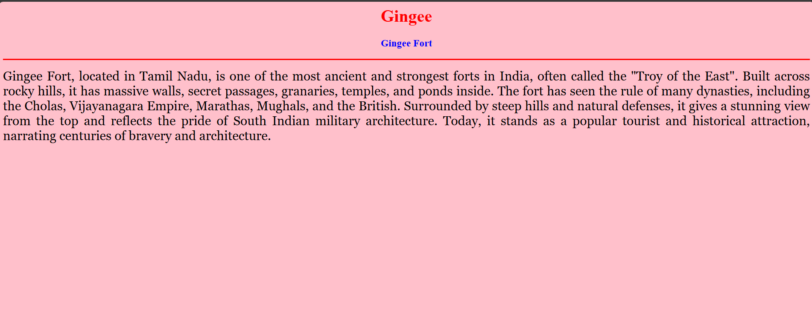
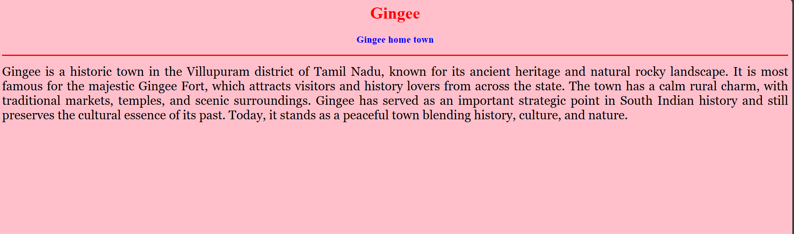

# Ex04 Places Around Me
## Date: 1.11.25

## AIM
To develop a website to display details about the places around my house.

## DESIGN STEPS

### STEP 1
Create a Django admin interface.

### STEP 2
Download your city map from Google.

### STEP 3
Using ```<map>``` tag name the map.

### STEP 4
Create clickable regions in the image using ```<area>``` tag.

### STEP 5
Write HTML programs for all the regions identified.

### STEP 6
Execute the programs and publish them.

## CODE
```
<html>
<head>
<title>My City</title>
</head>
<body>
<h1 align="center">
<font color="red"><b>Gingee</b></font>
</h1>
<h3 align="center">
<font color="blue"><b>Madhan C (212224240081)</b></font>
</h3>
<center>

<map name="MyCity">
<area shape="rect" coords="700,250,850,400" href="home.html" title="My Home Town">
<area shape="rect" coords="400,300,500,500" href="fort.html" title="Ginge fort"></map>
</center>
</body>
</html>

## Home town 

<html>
<head>
<title>My Home town</title>
</head>
<body bgcolor="pink">
<h1 align="center">
<font color="red"><b>Gingee</b></font>
</h1>
<h3 align="center">
<font color="blue"><b>Gingee home town</b></font>
</h3>
<hr size="3" color="red">
<p align="justify">
<font face="Georgia" size="5">
Gingee is a historic town in the Villupuram district of Tamil Nadu, known for its ancient heritage and natural rocky landscape.
It is most famous for the majestic Gingee Fort, which attracts visitors and history lovers from across the state. The town has a calm rural charm, with traditional markets, temples, and scenic surroundings.
Gingee has served as an important strategic point in South Indian history and still preserves the cultural essence of its past.
Today, it stands as a peaceful town blending history, culture, and nature.</font>
</p>
</body>
</html>

## Ginge fort 

<html>
<head>
<title>My Home town</title>
</head>
<body bgcolor="pink">
<h1 align="center">
<font color="red"><b>Gingee</b></font>
</h1>
<h3 align="center">
<font color="blue"><b>Gingee Fort</b></font>
</h3>
<hr size="3" color="red">
<p align="justify">
<font face="Georgia" size="5">
Gingee Fort, located in Tamil Nadu, is one of the most ancient and strongest forts in India,
often called the "Troy of the East". Built across rocky hills, it has massive walls, secret passages, granaries, temples, and ponds inside.
The fort has seen the rule of many dynasties, including the Cholas, Vijayanagara Empire, Marathas, Mughals, and the British. Surrounded by steep hills and natural defenses, it gives a stunning view from the top and reflects the pride of South Indian military architecture.
Today, it stands as a popular tourist and historical attraction, narrating centuries of bravery and architecture.</font>
</p>
</body>
</html>
```

## OUTPUT




## RESULT
The program for implementing image maps using HTML is executed successfully.
